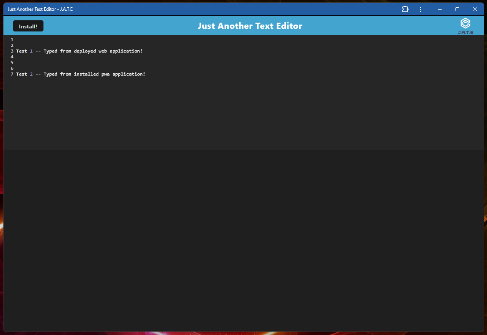
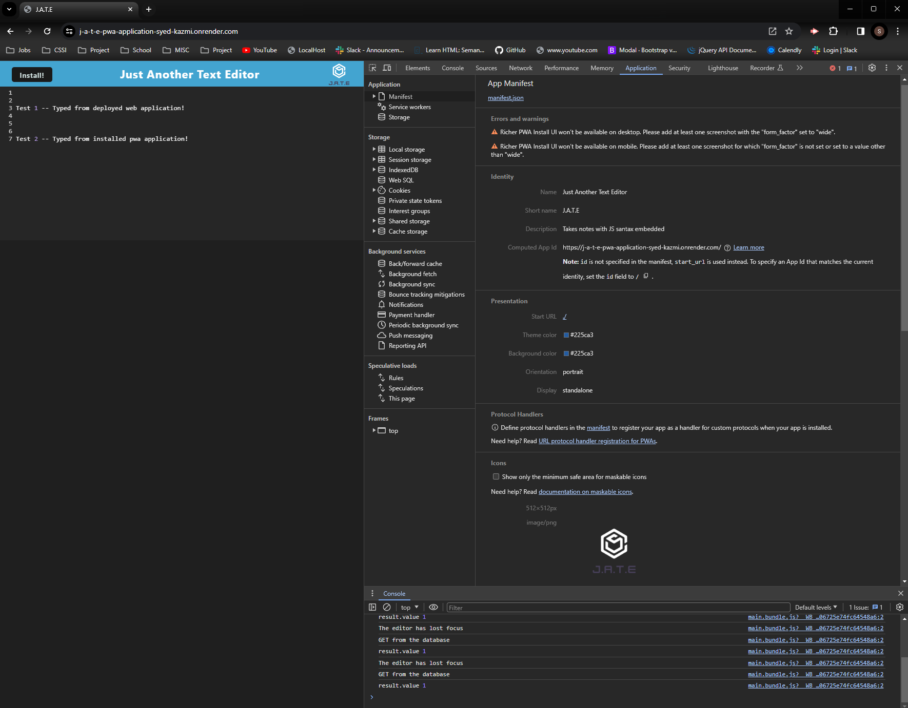
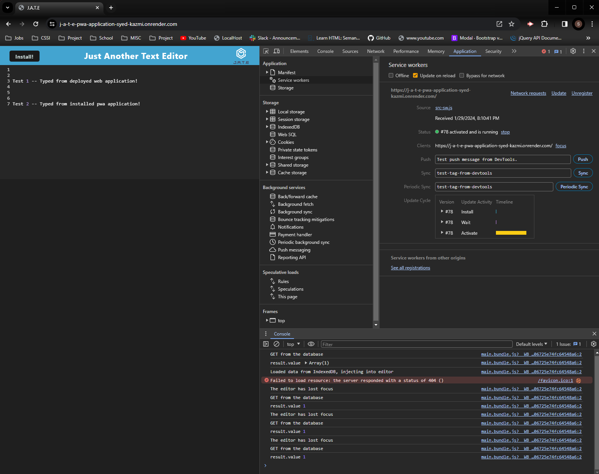
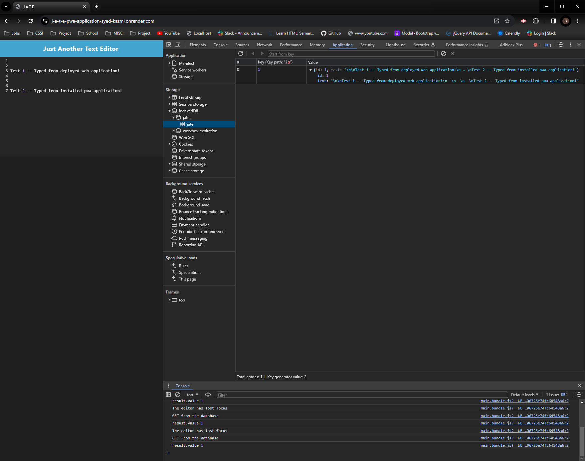
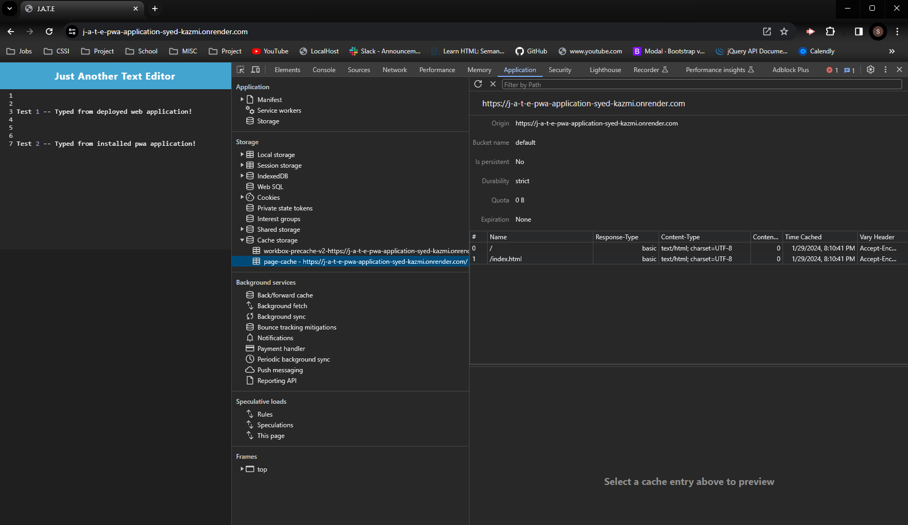

# J.A.T.E Progressive Web Application (PWA)

The Just Another Text Editor (J.A.T.E) PWA was created to implement persistence strategies for web application using Client-Server structure, webpack-bundle, service-worker, manifest.json, and indexed db. This allow the applicaiton to be reloaded from the same instance, on page reload or if offline. It also allows the application to be installed and used in offline mode.

## Features

- webpack-bundle used to increase performance of server-fetch.
- webpack injestManifest used to define cache-first strategy.
- workbox manifest used to allow the application to be downloaded and used separate from the brower.
- indexed db and local storage used for text editor content storage redundancy.
- cache storage used for storing all resources to decrease fetching from server for every requests. 

## Appendix

https://www.npmjs.com/package/webpack-pwa-manifest

https://webpack.js.org/guides/getting-started/

https://developer.chrome.com/docs/workbox/caching-strategies-overview

https://developer.mozilla.org/en-US/docs/Learn/Server-side/First_steps/Client-Server_overview

https://www.npmjs.com/package/concurrently

https://coding-boot-camp.github.io/full-stack/render/render-deployment-guide

## Authors

- [Syed Kazmi](https://github.com/kazmiali123)
## Deployment

Deployed on Render: https://j-a-t-e-pwa-application-syed-kazmi.onrender.com/

GitHub Repository: https://github.com/kazmiali123/J.A.T.E-Progressive-Web-App

## Demo

Installed Progressive Web Application (PWA) - Demo
  

PWA - Manifest.sjson
  

PWA - Service Worker Active
  

PWA - Indexed DB Storage
  

PWA - Cache Storage
  